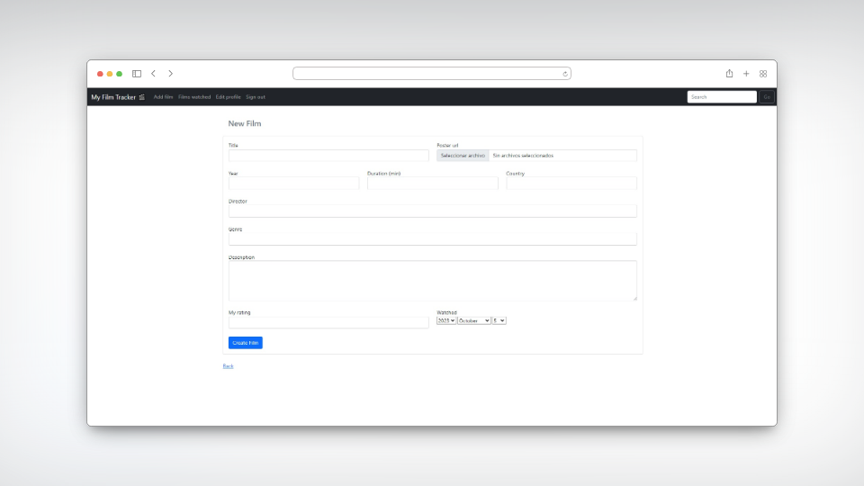

# MyFilmTracker

MyFilmTracker is a Ruby on Rails web application that allows you to keep track of the movies you've watched. You can add movies to your list, rate them, and record the date you watched them. With MyFilmTracker, you'll never forget a great movie you've seen.

## Key Features

### User Registration and Login

- Users can create a personalized account.
- Registered users can log in to their accounts.

### Add Movies



- Users can add movies to their personal list.
- Enter movie details, such as title, director, release year, genre, and a brief description.
- Rate the movies you've watched.
- Record the date you watched the movie.

### Movie Details and Ratings


- Users can view movie details, including title, director, release year, and description.


### List of Watched Movies


- Users can view a list of all the movies they've added, along with their ratings and viewing dates.
- Manage your movie collection with ease.


## Environment Setup

Ensure that you have Ruby and Ruby on Rails installed on your system. If not, you can follow the official Ruby and Ruby on Rails guides to install them.

### Clone the Repository

```bash
git clone https://github.com/yourusername/myfilmtracker.git
cd myfilmtracker
```

### Install Gems
Run the following command to install all the necessary gems:

```bash
bundle install
```

### Configure the Database
Ensure you configure the database in config/database.yml according to your preferences. Then, run the migrations:

```bash
rails db:migrate
```

### Start the Server
Start the Rails server with the following command:

```bash
rails server

```

Make sure to perform these steps to set up the environment for your MyFilmTracker application. This will prepare your system for running the application locally.

